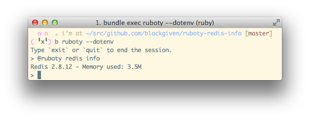

# Ruboty::Redis::Info

ruboty plugin for show redis info.

ported from [lita](https://github.com/jimmycuadra/lita/blob/8dd9a8c744f649a5cfe171f984d941d66e4d14ad/lib/lita/handlers/info.rb).



## Installation

Add this line to your application's Gemfile:

```ruby
gem 'ruboty-redis-info'
```

And then execute:

    $ bundle

Or install it yourself as:

    $ gem install ruboty-redis-info

## Usage

    @ruboty redis info

## Contributing

1. Fork it ( https://github.com/blockgiven/ruboty-redis-info/fork )
2. Create your feature branch (`git checkout -b my-new-feature`)
3. Commit your changes (`git commit -am 'Add some feature'`)
4. Push to the branch (`git push origin my-new-feature`)
5. Create a new Pull Request
